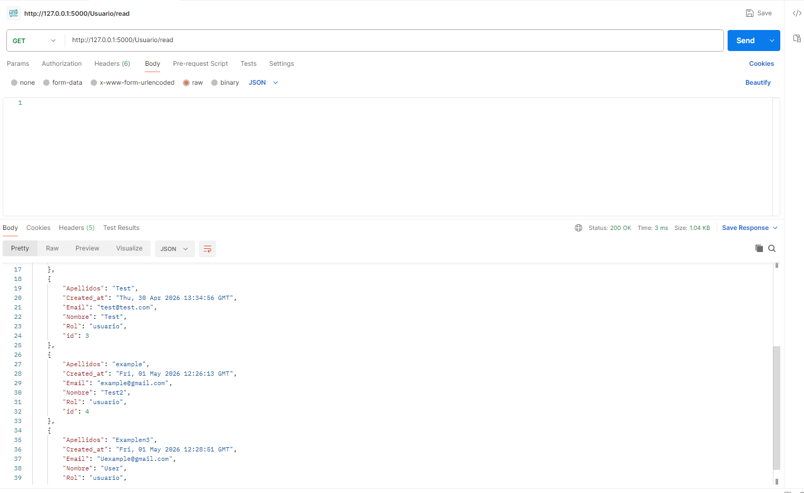
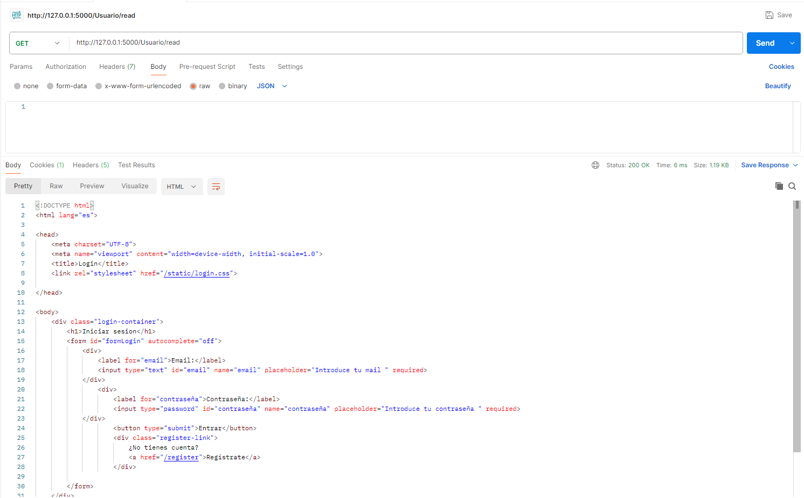
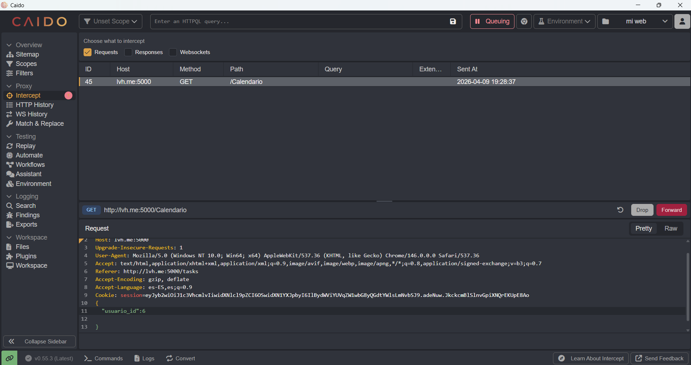
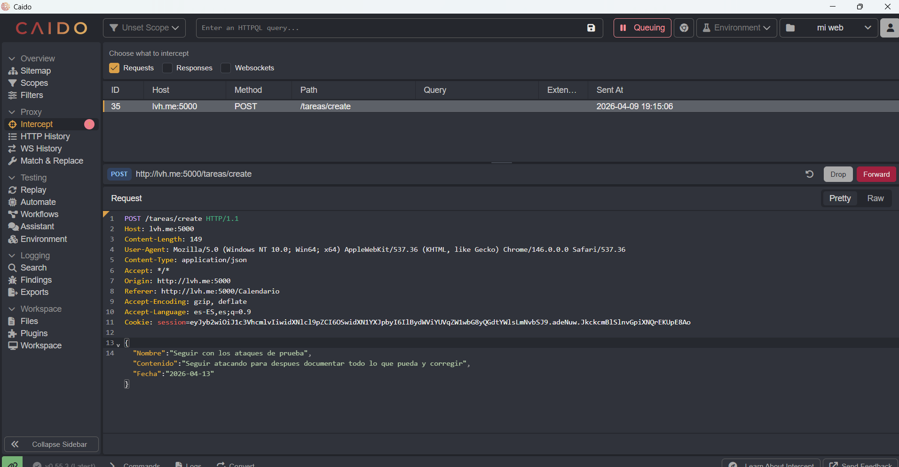
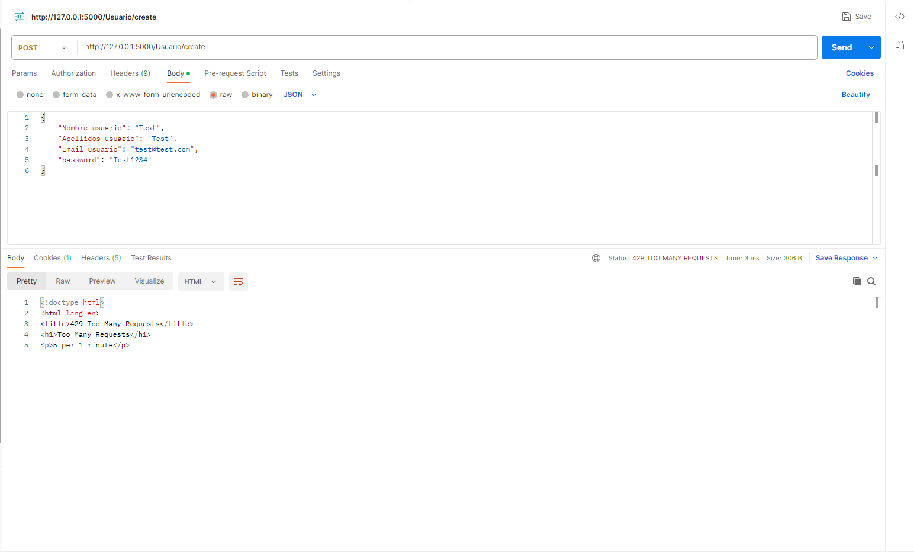

# Web Security Lab


## 1. Project Description

This project documents the complete security lifecycle of a web-based task management application (Task Manager), from its functional development to its security validation.

The process was structured in three key stages:

- **Development Phase:** A functional application was built using Python (Flask) and SQLAlchemy, designed to serve as an experimentation environment for cybersecurity purposes.
- **Offensive Audit Phase:** Once functional, the application underwent an exhaustive security analysis using Caido and Postman. The goal was to identify logical vulnerabilities and attack vectors, simulating unauthorized access tests and code injection attempts.
- **Remediation and Validation Phase:** After findings were identified, the code was corrected to mitigate the identified risks. The interception tool stack (Caido/Postman) was then used again to revalidate the effectiveness of the security measures implemented.

## 2. Technologies and Tools

**Development Stack**
- Language: Python
- Web Framework: Flask
- Database / ORM: SQLAlchemy
- Frontend: HTML5, CSS3 and JavaScript

**Audit and Pentesting Tools**
- Traffic Interception: Caido
- API Logic Testing: Postman

## 3. Local Deployment

1. Clone the repository
```bash
git clone https://github.com/Sara29-hub/web-security-lab.git
cd web-security-lab
```

2. Create the virtual environment
```bash
python -m venv venv
```

3. Activate it
```bash
# Windows
venv\Scripts\activate
# Mac/Linux
source venv/bin/activate
```

4. Install dependencies
```bash
pip install -r requirements.txt
```

5. Create the `.env` file in the project root with:
You can generate one with:
```bash
python -c "import secrets; print(secrets.token_hex(32))"
```

6. Create the database and admin user
```bash
python seed.py
```

7. Run the app
```bash
python app.py
```
The app will be available at `http://127.0.0.1:5000`

## 4. Documented Vulnerabilities

### Vulnerability 1: Missing Authentication - User Data Exposure
- **Type:** Broken Access Control (OWASP A01:2021)
- **Description:** The `/Usuario/read` route required no authentication, allowing anyone to access the complete information of all registered users without being logged in.
- **Exploitation:** Using Postman, a GET request was made to `/Usuario/read` without any session cookie, obtaining a list with name, surname, email, role and creation date of all users.
- **Fix:** The `@admin_required` decorator was implemented on the route, restricting access only to authenticated users with administrator role.





### Vulnerability 2: Privilege Escalation via Manipulated Registration
- **Type:** Broken Access Control (OWASP A01:2021)
- **Description:** The `/Usuario/create` route accepted the Role field directly from the JSON request body, allowing anyone to register as an administrator simply by including `"Rol usuario": "admin"` in the request.
- **Exploitation:** Using Postman, a POST request was made to `/Usuario/create` with the field `"Rol usuario": "admin"`, successfully creating a user with administrator privileges without any restriction.
- **Fix:** The dependency on the role field sent by the client was removed. The backend now always assigns `Rol = "usuario"` by default. The only way to create an administrator is through the `seed.py` script directly on the server.

### Vulnerability 3: SQL Injection
- **Type:** Injection (OWASP A03:2021)
- **Description:** The application's resistance to SQL injection attacks was evaluated at data entry points, mainly in the login form.
- **Exploitation:** Classic SQL Injection payloads such as `' OR '1'='1`, `' OR 1=1 --` and `admin'--` were tested via Postman in the email and password fields.
- **Result:** The application resisted all attempts. SQLAlchemy uses parameterized queries by default, neutralizing this type of attack.
- **Conclusion:** Although no exploitable vulnerability was found, this test confirms that using an ORM like SQLAlchemy is a good security practice that automatically protects against SQL Injection.

### Vulnerability 4: Missing Authentication on User Modification Routes
- **Type:** Broken Access Control (OWASP A01:2021)
- **Description:** The `/Usuario/update` and `/Usuario/delete` routes required no prior authentication, allowing any attacker to modify or delete any user from the database simply by knowing their ID.
- **Exploitation:** Using Postman, PUT requests to `/Usuario/update` and DELETE requests to `/Usuario/delete` were made without any session cookie, successfully updating a user's name and completely deleting another, using only the `id` field in the request body.
- **Fix:** The `@login_required` decorator was created to check for an active session before allowing access to the route, applied to both `/Usuario/update` and `/Usuario/delete`.

### Vulnerability 5: IDOR (Insecure Direct Object Reference)
- **Type:** Broken Access Control (OWASP A01:2021)
- **Description:** It was evaluated whether an authenticated user could access another user's tasks by manipulating the user identifier in the request.
- **Exploitation:** Using Caido, the GET request to `/tareas/read` was intercepted and the Replay functionality was used to modify it by manually adding the `"usuario_id"` field with another user's ID.
- **Result:** The application resisted the attack. The backend ignores any `usuario_id` sent in the request body and uses exclusively the ID stored in the Flask session.
- **Conclusion:** IDOR protection is correctly implemented thanks to the use of `flask_session['user_id']` instead of trusting client-sent data.



### Vulnerability 6: Hardcoded Secret Key
- **Type:** Security Misconfiguration (OWASP A05:2021)
- **Description:** The Flask secret key was defined directly in the source code as `app.secret_key = 'clave_secreta'`. If an attacker accesses the code through a public GitHub repository, they could use it to forge session cookies and impersonate any user, including the administrator.
- **Exploitation:** With the code uploaded to a repository, anyone with access could read the key directly and use it to forge valid session cookies without credentials.
- **Fix:** The secret key was moved to an environment variable using `python-dotenv`. In the code it becomes `app.secret_key = os.environ.get('SECRET_KEY')` and the real value is stored in a `.env` file included in `.gitignore`.

### Vulnerability 7: Absence of Rate Limiting
- **Type:** Security Misconfiguration (OWASP A05:2021)
- **Description:** The `/Usuario/create` route had no request limit, allowing an attacker to make an unlimited number of requests in a short time to create bot accounts, saturate the server or perform automated brute force attacks.
- **Exploitation:** Using Postman, multiple consecutive requests were made to `/Usuario/create` without any restriction, confirming the server accepted them all without limit.
- **Fix:** The `flask-limiter` library was implemented adding the `@limiter.limit("5 per minute")` decorator, allowing only 5 requests per minute from the same IP. From the sixth request onwards the server returns a **429 Too Many Requests** error.



## 5. Conclusions

This project has been a first practical approach to the complete security lifecycle of web applications. Building a functional application from scratch and then analyzing it as an attacker has allowed a real understanding of why certain bad practices pose a risk.

Among the most relevant learnings are the importance of protecting all routes with appropriate access levels, never trusting data sent by the client, and correctly managing application secrets. The use of tools such as Postman and Caido has allowed real attacks to be simulated and an understanding of how an attacker interacts with an API.

As next steps, the goal is to deepen backend development skills and evolve towards Application Security, applying this knowledge in more complex environments.
